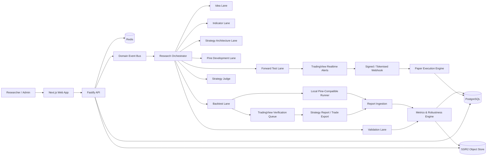
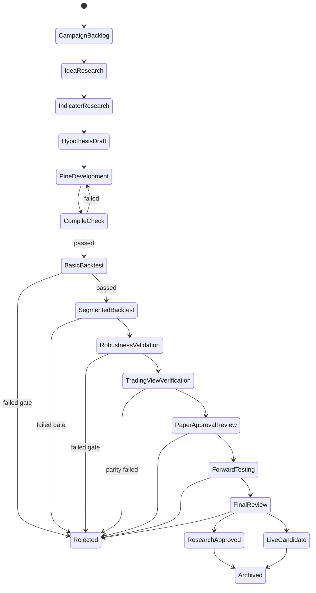
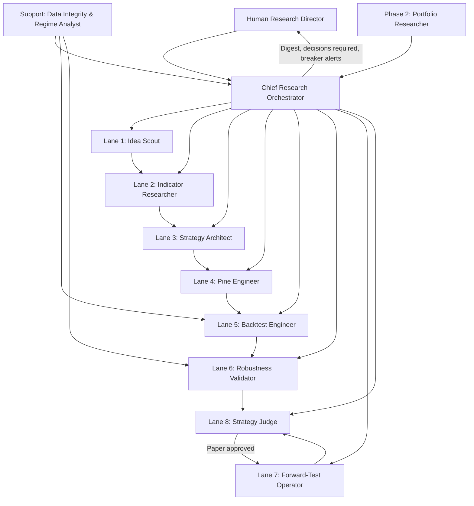
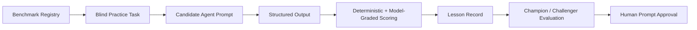

# AI Research Hedge Fund Operating System

**Working name:** ARF-OS  
**Document status:** Build-ready product and engineering specification  
**Primary implementation language:** TypeScript  
**Strategy language:** Pine Script® v6  
**Deployment target:** Railway-compatible services  
**Primary research output:** Reproducible, versioned trading-strategy evidence packs  
**Primary safety rule:** Research approval is not permission to deploy live capital

---

## 0. Executive summary

ARF-OS is a multi-agent research operating system for discovering, building, testing, rejecting, forward-testing, and cataloguing systematic trading strategies.

The system is deliberately designed as a **research factory**, not as one all-powerful trading agent. A leader agent coordinates independent specialist lanes:

1. Idea Discovery
2. Indicator Research
3. Strategy Architecture
4. Pine Script Development
5. Backtesting
6. Robustness Validation
7. Forward Testing
8. Strategy Judgement
9. Data Integrity and Market-Regime Support
10. Portfolio Research, added after individual-strategy validation is mature

Every strategy moves through an immutable, evidence-based lifecycle. Each lane receives a formal input contract and must return a formal output contract. An agent cannot silently rewrite the hypothesis, tune on protected out-of-sample data, overwrite a previous strategy version, or promote its own work.

The system has two backtesting paths:

- **Research runner:** a scalable Pine-compatible backtesting engine for automated exploration, parameter sweeps, segmentation, and stress testing.
- **TradingView verification runner:** TradingView remains the final parity and acceptance environment for Pine strategies. Strategy reports and trade exports are ingested into ARF-OS.

This separation is necessary because TradingView provides Pine strategy execution, report exports, deep historical testing, and realtime alerts, but not a clean public batch API for programmatically compiling and executing thousands of Strategy Tester runs. A browser-automation dependency must not become the core of the platform. Human-assisted TradingView verification is acceptable for the MVP; a terms-reviewed automation path may be added later.

The product consists of:

- A leader-agent control plane
- Independent research lanes
- A durable workflow and queue system
- A strategy/version registry
- A backtest and forward-test evidence store
- A web application for research operations
- A practice arena where agents improve against blind benchmark tasks
- An investment-committee queue where final decisions are made from evidence, not persuasive prose

---

## 1. Assumptions and terminology

### 1.1 Interpretation of “segments”

This specification interprets “backtest segments” as a disciplined set of historical windows used for:

- In-sample development
- Validation
- Out-of-sample testing
- Rolling or anchored walk-forward analysis
- Regime-specific testing
- Final untouched holdout testing

The segment model is configurable. Nothing in the architecture requires a particular number or duration of segments.

### 1.2 “Hedge fund” terminology

ARF-OS may use “AI Research Hedge Fund” as an internal project name, but the initial product is a **strategy research and paper-validation platform**. It must not represent itself as a regulated fund, investment adviser, broker, or autonomous capital manager without the appropriate legal structure, licences, controls, disclosures, and human governance.

### 1.3 Strategy approval levels

A strategy can receive one of these statuses:

- `RESEARCH_APPROVED`: historical evidence is sufficient for continued research.
- `PAPER_APPROVED`: the strategy may enter a controlled forward-test environment.
- `LIVE_CANDIDATE`: the strategy has passed defined forward-test requirements and may be reviewed by a human for live deployment.
- `LIVE_APPROVED`: only a human-authorised external process can grant this state.
- `REJECTED`: the current version failed one or more gates.
- `ARCHIVED`: retained for knowledge but no longer active.

No model or agent can independently grant `LIVE_APPROVED`.

---

## 2. Product goals

### 2.1 Primary goals

ARF-OS must:

1. Turn vague market ideas into falsifiable strategy hypotheses.
2. Produce deterministic, readable Pine Script v6 strategies.
3. Run reproducible backtests with realistic costs and documented assumptions.
4. Separate training, validation, out-of-sample, and forward-test evidence.
5. Detect common forms of overfitting, repainting, leakage, and fragile execution.
6. Preserve complete lineage from source idea to final decision.
7. Make failed research searchable so agents do not repeatedly rediscover the same dead ends.
8. Display strategy equity, drawdown, trades, segments, parameter sensitivity, and forward-test drift.
9. Allow agents to practise on benchmark tasks without contaminating production evaluation.
10. Scale from a small research lab to many concurrent campaigns without losing auditability.

### 2.2 Secondary goals

- Support crypto, forex, futures, indices, metals, and equities.
- Support multiple strategy families, timeframes, sessions, and cost models.
- Build a reusable strategy library and component library.
- Measure strategy similarity and portfolio correlation.
- Support multiple model providers without binding core research logic to one vendor.
- Support user-created research campaigns and approval policies.

### 2.3 Non-goals for the first release

The MVP will not:

- Place live orders.
- Hold exchange API keys.
- Allow agents to move capital.
- Guarantee profitability.
- Optimise directly on forward-test results.
- Use screenshots as the canonical source of metrics.
- Treat a single attractive equity curve as sufficient evidence.
- depend on unreviewed browser automation for core backtesting.
- allow agents to edit production prompts without evaluation and approval.

---

## 3. Design principles

### 3.1 Evidence over persuasion

Agents are rewarded for producing testable evidence, finding failure, and rejecting weak strategies. They are not rewarded for writing confident narratives.

### 3.2 Immutable versions

Any change to logic, parameters, cost assumptions, market, timeframe, or execution settings creates a new `StrategyVersion`. Historical results remain attached to the exact version that generated them.

### 3.3 Separation of duties

The agent that creates or optimises a strategy cannot be the sole approver. The validation lane operates adversarially. The final judge reads an evidence bundle that includes failures and dissent.

### 3.4 Protected data

Out-of-sample and final holdout segments are protected. An agent receives only the information required for its current stage. Once a protected result has influenced a design change, that data is no longer considered untouched for the resulting version.

### 3.5 Reproducibility

Every result must be reproducible from:

- Source-code hash
- Strategy manifest
- Dataset identity and checksum
- Symbol and venue
- Timeframe
- Session and timezone
- Date range
- Pine/runtime version
- Commission and slippage
- Position sizing and leverage
- Runner version
- Parameter values
- Random seed, where applicable

### 3.6 Simplicity before complexity

The Strategy Architect must start with the smallest rule set capable of expressing the hypothesis. Complexity must earn its place through predeclared evidence, not through retrospective curve improvement.

### 3.7 Kill weak ideas quickly

Cheap gates run first. Compilation, causality, repaint checks, minimum-trade checks, and basic cost sensitivity should eliminate weak candidates before expensive robustness and forward tests.

### 3.8 Research is a state machine

No stage is implicit. Every transition is an auditable decision with a reason, actor, timestamp, evidence references, and policy version.

---

## 4. High-level architecture



### 4.1 Four planes

#### Control plane

Owns campaigns, workflow state, budgets, policies, approvals, agent assignments, retries, and audit events.

#### Research plane

Runs specialist agents and stores their structured outputs, citations, assumptions, objections, and handoffs.

#### Test plane

Compiles or interprets Pine, runs historical tests, ingests TradingView reports, computes independent metrics, and executes robustness checks.

#### Observation plane

Presents the entire process through the frontend and provides logs, traces, alerts, data-health status, and agent-performance analytics.

---

## 5. Research lifecycle



### 5.1 Required state-transition record

Every transition records:

- `from_state`
- `to_state`
- `strategy_version_id`
- `decision`
- `reason_codes[]`
- `free_text_summary`
- `evidence_ids[]`
- `policy_version`
- `actor_type`
- `actor_id`
- `created_at`
- `human_override`
- `override_reason`, when applicable

### 5.2 Version branching

A rejected version may produce a new child version only when the proposed change is explicit. The lineage graph must show:

- Parent version
- Change category
- Changed fields
- Evidence that motivated the change
- Data that is now considered contaminated
- New protected holdout assignment

---

## 6. Agent organisation

### 6.1 Organisation chart



Reporting flows back to the Human Research Director under §27. Risk breakers (§28)
are deterministic software gates, not agents, and so do not appear as nodes; live
execution (§29) has no agent path at all.

### 6.2 Shared rules for all agents

Every specialist agent must:

- Accept and return typed structured data.
- State assumptions and unknowns.
- Cite every external source used in research.
- Distinguish fact, inference, hypothesis, and preference.
- Produce a confidence score with calibration notes.
- Record rejected alternatives.
- Never alter another lane’s artefact silently.
- Never claim a strategy is “good” from a single metric.
- Never use protected holdout information unless authorised for that stage.
- Never hide failed runs.
- Never use live capital.
- Stop and escalate on data-integrity uncertainty.
- Treat missing evidence as missing, not as favourable.
- Return `BLOCKED` instead of inventing required data.

---

## 7. Role specifications

## 7.1 Chief Research Orchestrator

### Mission

Convert research objectives into auditable campaigns, coordinate the specialist lanes, enforce stage gates, manage budgets, resolve conflicts, and produce final evidence packs.

### Inputs

- Research campaign brief
- Allowed markets, symbols, and timeframes
- Research budget
- Approval policy
- Available datasets and tools
- Current strategy library
- Previous failure knowledge
- Human priorities

### Responsibilities

1. Decompose a campaign into discrete hypotheses.
2. Select the correct specialist lane for each task.
3. Prevent role overlap and self-approval.
4. Enforce protected-data boundaries.
5. Set compute and token budgets.
6. Detect duplicate or near-duplicate ideas.
7. Choose when to branch, retry, reject, or escalate.
8. Ensure every handoff meets its schema.
9. Maintain a campaign decision log.
10. Assemble the final evidence pack.
11. Schedule practice tasks separately from production work.
12. Compare agent performance by role and prompt version.
13. Keep the research backlog prioritised by expected information value, not excitement.

### Allowed actions

- Create tasks and subtasks
- Assign agents
- Pause or cancel work
- Request missing evidence
- Move items through gates when policy conditions are met
- Recommend prompt changes
- Request human judgement

### Prohibited actions

- Writing the production Pine strategy as a substitute for the Pine Engineer
- Approving its own strategy recommendation without an independent judge
- Revealing protected holdout results to upstream agents
- Changing thresholds after seeing a result
- Granting live-trading approval

### Required outputs

- `CampaignPlan`
- `TaskGraph`
- `BudgetAllocation`
- `DailyResearchDigest`
- `DecisionRecord`
- `EvidenceBundle`
- `EscalationRequest`

### Success metrics

- Percentage of tasks with valid handoffs
- Reproducibility rate
- Duplicate-research avoidance
- Cost per valid candidate
- Time to kill weak candidates
- Holdout-contamination incidents
- Human override rate
- False-promotion rate measured retrospectively

### Practice curriculum

- Decompose ambiguous briefs into falsifiable hypotheses
- Detect missing contracts
- Identify leakage across multi-agent handoffs
- Prioritise experiments by information gain
- Resolve conflicting specialist recommendations
- Reject persuasive but unsupported proposals

---

## 7.2 Lane 1 — Idea Scout

### Mission

Discover potentially testable sources of edge and turn them into concise, falsifiable idea cards.

### Search domains

- Academic and practitioner research
- Market microstructure
- Behavioural effects
- Trend, mean reversion, carry, momentum, seasonality, volatility, breadth
- Cross-asset relationships
- Open-source scripts and public strategy discussions
- Indicator combinations
- Execution effects
- Market-session behaviour
- Structural changes in specific venues
- Failure patterns from the internal strategy graveyard

### Responsibilities

1. Search broadly but report narrowly.
2. Separate an observation from a strategy.
3. Explain the proposed causal or behavioural mechanism.
4. Define where the edge should and should not exist.
5. Identify required data and whether Pine can access it.
6. Check source licensing and attribution requirements.
7. Search the internal knowledge base for duplicates.
8. Propose the cheapest falsification test.
9. Identify likely implementation and overfitting risks.
10. Avoid simply copying published performance claims.

### Idea Card output

Each idea must include:

- Title
- One-sentence hypothesis
- Source summary
- Source links and licences
- Market mechanism
- Expected direction
- Target assets
- Target timeframes
- Expected regime
- Failure regime
- Required inputs
- Pine feasibility
- Expected trade frequency
- Cheapest falsification test
- Novelty score
- Evidence strength
- Similar internal strategies
- Risks
- Recommendation: `RESEARCH`, `PARK`, or `REJECT`

### Acceptance criteria

An idea is accepted for indicator research only when:

- It is falsifiable.
- It has a plausible market mechanism or clearly labelled empirical rationale.
- Required data exists.
- It is not a duplicate without a meaningful differentiator.
- It can be expressed within the platform’s current test environment.
- The idea does not depend on future information.

### Failure modes to detect

- “This chart looked good”
- Unverifiable performance claims
- Survivorship bias
- Cherry-picked symbol or date range
- Hidden discretionary rules
- Data unavailable in Pine
- Source code with incompatible licence
- An “idea” that is merely a parameter combination

### Success metrics

- Percentage of ideas reaching a valid hypothesis
- Duplicate rate
- Falsification efficiency
- Source quality score
- Number of later failures predictable from the original risk notes

### Practice curriculum

- Classify good versus unfalsifiable ideas
- Extract hypotheses from papers
- Detect copied strategies with renamed indicators
- Identify Pine-incompatible data requirements
- Predict likely failure regimes

---

## 7.3 Lane 2 — Indicator Researcher

### Mission

Find, analyse, and qualify indicators or transformations that could operationalise an approved idea.

### Responsibilities

1. Build an `IndicatorCard` for each candidate.
2. Explain what the indicator measures mathematically and economically.
3. Test whether it repaints or leaks future data.
4. Document higher-timeframe and lower-timeframe behaviour.
5. Define sane parameter ranges before optimisation.
6. Identify redundancy with other indicators.
7. Characterise lag, responsiveness, scale, and normalisation.
8. Specify regime sensitivity.
9. Produce minimal Pine pseudocode.
10. Propose synthetic tests that prove expected behaviour.

### Indicator categories

- Signal generators
- Regime filters
- Trend filters
- Volatility filters
- Entry timing tools
- Exit timing tools
- Risk and sizing inputs
- Confirmation tools
- Market-state labels

### Indicator Card output

- Name and internal ID
- Formula
- Inputs and parameter ranges
- Intended role
- Economic interpretation
- Expected signal direction
- Warm-up requirement
- Repainting analysis
- Multi-timeframe analysis
- Missing-data behaviour
- Normalisation
- Computational cost
- Correlation/redundancy notes
- Candidate markets and timeframes
- Known failure modes
- Licensing/source
- Pine v6 implementation notes
- Unit-test scenarios
- Recommendation

### Acceptance criteria

- No unexplained future-data dependency.
- Parameter search space is bounded and justified.
- Indicator has a defined role in the strategy.
- Behaviour can be tested independently.
- MTF usage has a non-repainting construction.
- Indicator is not added only because it improves the historical curve.

### Prohibited behaviour

- Selecting parameters from final holdout performance
- Using an indicator with unknown repainting behaviour
- Combining many correlated indicators to manufacture confirmation
- Treating a public script’s plotted arrows as evidence of tradability

### Success metrics

- Repainting defects found before development
- Parameter-range quality
- Redundancy reduction
- Unit-test pass rate
- Downstream code-rework rate

### Practice curriculum

- Review known repainting and non-repainting scripts
- Explain indicator mechanics from code
- Identify hidden lookahead in MTF logic
- Design bounded parameter spaces
- Match indicators to specific strategy roles

---

## 7.4 Lane 3 — Strategy Architect

### Mission

Convert idea and indicator evidence into a complete, deterministic strategy specification before code is written.

### Responsibilities

1. Define the exact entry and exit state machine.
2. Define long, short, or both.
3. Define session, timezone, and market constraints.
4. Define one initial stop-loss and one take-profit by default.
5. Define position sizing and leverage assumptions.
6. Define trade invalidation and re-entry rules.
7. Define pyramiding and reversal behaviour.
8. Define warm-up and no-trade periods.
9. Define cost model and order type.
10. Define testable expectations by regime.
11. Declare all optimisable parameters and freeze all others.
12. Produce a machine-readable Strategy Definition Language document.
13. Keep the first implementation intentionally minimal.
14. Pre-register expected failure conditions.

### Strategy design rules

- Default `pyramiding = 0`.
- Default calculation occurs on confirmed bar close.
- One position direction at a time unless the hypothesis explicitly requires otherwise.
- One TP and one SL per trade in the initial architecture.
- No hidden discretionary override.
- Every condition must map to a named variable.
- Every parameter must have units, range, default, and rationale.
- Entry and exit signals must be separated from execution assumptions.
- Time filters must use explicit timezone semantics.
- Non-standard charts cannot be used for order fills unless standard OHLC fill behaviour is enforced.

### Required outputs

- `StrategyDefinition`
- `ParameterManifest`
- `BacktestExpectations`
- `FailureModeRegister`
- `SyntheticTestPlan`
- `ChangeImpactNotes`

### Acceptance criteria

A strategy can enter development only when another agent can implement it without asking what the rules mean.

### Success metrics

- Ambiguity defects discovered during coding
- Number of post-code logic changes
- Complexity per trade rule
- Percentage of parameters with predeclared ranges
- Percentage of strategies with explicit failure-regime predictions

### Practice curriculum

- Turn vague prose into deterministic rules
- Remove unnecessary conditions
- Spot implicit discretion
- Define order timing exactly
- Pre-register falsification criteria

---

## 7.5 Lane 4 — Pine Script Engineer

### Mission

Implement the approved Strategy Definition exactly in Pine Script v6, with deterministic behaviour, instrumentation, alerts, and tests.

### Responsibilities

1. Use the approved Pine boilerplate.
2. Preserve a one-to-one mapping from strategy rules to named code sections.
3. Implement inputs from the parameter manifest.
4. Add commission, slippage, margin, sizing, and execution properties.
5. Add date-window and segment inputs.
6. Add non-repainting MTF logic.
7. Add stable order IDs and machine-readable alert payloads.
8. Add diagnostic plots and debug table behind a toggle.
9. Write a strategy manifest containing source hash and settings.
10. Run local compile and static checks.
11. Produce synthetic test evidence.
12. Document any unavoidable deviation from the Strategy Definition.
13. Create a new revision rather than editing a tested revision in place.

### Deliverables

- `strategy.pine`
- `strategy.manifest.json`
- `strategy.tests.json`
- `compile-report.json`
- `implementation-notes.md`
- Source-code hash
- Generated alert examples

### Prohibited behaviour

- Optimising logic while coding
- Adding filters not present in the approved definition
- Using future-looking constructs
- Suppressing errors or warnings
- Returning code without a manifest
- Changing execution properties to improve metrics
- Using `calc_on_every_tick` by default
- Using unconfirmed higher-timeframe values without explicit approval

### Acceptance criteria

- Pine v6 syntax.
- Passes static anti-leak checks.
- Compiles in the research runner.
- Compiles in TradingView during verification.
- Produces expected synthetic signals.
- Manifest values match code properties.
- No unexplained difference from the Strategy Definition.

### Success metrics

- First-pass compile rate
- Parity between definition and code
- Number of validation defects
- Reproducibility
- Test coverage of state transitions
- TradingView parity rate

### Practice curriculum

- Implement reference strategies from typed definitions
- Repair repainting scripts
- Reproduce known trade lists
- Implement sessions and MTF safely
- Build machine-readable alert messages
- Diagnose parity failures between engines

---

## 7.6 Lane 5 — Backtest Engineer

### Mission

Execute a predeclared backtest plan, preserve the exact environment, ingest results, and report evidence without changing the strategy.

### Responsibilities

1. Validate the test plan before running.
2. Confirm dataset identity and health.
3. Run smoke tests first.
4. Run baseline tests with realistic costs.
5. Execute parameter searches only on allowed in-sample segments.
6. Freeze selected parameters before protected evaluation.
7. Run rolling and/or anchored segment tests.
8. Run cross-symbol and cross-regime matrices.
9. Export and ingest TradingView strategy reports.
10. Reconstruct independent equity and drawdown series.
11. Detect missing, duplicated, impossible, or out-of-order trades.
12. Compare local-runner and TradingView results.
13. Record all failed and cancelled runs.
14. Never choose the “best-looking” run without the declared selection rule.

### Required outputs

- `BacktestPlan`
- `BacktestRun[]`
- `SegmentResult[]`
- `TradeLedger`
- `EquitySeries`
- `MetricSnapshot`
- `ParameterSelectionRecord`
- `ParityReport`
- `DataQualityReport`

### Acceptance criteria

- All runs reference immutable code and data.
- Costs and sizing are explicit.
- Protected data was not used for selection.
- At least one independent metric calculation matches the runner within tolerance.
- The strategy has enough trades for the intended inference, or is explicitly marked low-sample.
- No unresolved parity failure.

### Success metrics

- Reproduction rate
- Runner parity
- Data-quality incident rate
- Cost per completed matrix
- Percentage of runs with complete artefacts
- Protected-data compliance

### Practice curriculum

- Reproduce canonical backtests
- Detect broken trade exports
- Select parameters by predeclared rules
- Diagnose TradingView/local mismatches
- Identify low-sample false confidence
- Verify cost and sizing semantics

---

## 7.7 Lane 6 — Robustness Validator

### Mission

Act as a hostile reviewer. Attempt to break the strategy and determine whether the evidence supports promotion.

### Independence rule

The validator cannot be the same model run, prompt instance, or agent identity that designed or optimised the strategy.

### Responsibilities

1. Re-check causality and repainting.
2. Review all segment boundaries.
3. Measure in-sample versus out-of-sample degradation.
4. Test neighbouring parameters.
5. Test cost, slippage, and delayed-entry sensitivity.
6. Run trade-order and return-path Monte Carlo where valid.
7. Test concentration by month, trade, symbol, and regime.
8. Measure longest stagnation and recovery period.
9. Test alternate symbols and related markets.
10. Test start-date sensitivity.
11. Review selection bias and number of attempted variants.
12. Compare against simple benchmarks.
13. Calculate an evidence score and confidence grade.
14. Produce the strongest rejection case, even when recommending promotion.
15. Detect whether the edge depends on a few extreme trades.
16. Identify operational risks that historical testing cannot resolve.

### Core validation tests

- Segment stability
- Anchored walk-forward
- Rolling walk-forward
- Final holdout
- Parameter-neighbour stability
- Cost sensitivity
- Slippage sensitivity
- Entry delay
- Missed-trade simulation
- Start-date perturbation
- Symbol perturbation
- Regime breakdown
- Long-only / short-only breakdown
- Trade-removal concentration test
- Monte Carlo path analysis
- Benchmark comparison
- Multiple-testing penalty
- Local versus TradingView parity
- Realtime/repainting review

### Required outputs

- `ValidationReport`
- `RobustnessTest[]`
- `RiskRegister`
- `RejectionCase`
- `PromotionRecommendation`
- `EvidenceGrade`
- `UnresolvedQuestions[]`

### Promotion recommendation values

- `REJECT`
- `REWORK_WITH_NEW_VERSION`
- `PAPER_TEST`
- `RESEARCH_APPROVE`
- `INSUFFICIENT_EVIDENCE`

### Prohibited behaviour

- Adjusting the strategy to pass tests
- Hiding failed tests
- Reclassifying segments after results
- Using narrative quality as a scoring factor
- Treating backtest profitability as proof of future profitability

### Success metrics

- Percentage of fragile strategies caught
- Forward-test failure prediction
- False rejection rate
- Calibration of evidence grades
- Number of hidden defects discovered
- Human agreement rate, without optimising for agreement

### Practice curriculum

- Identify overfit strategies from full evidence bundles
- Detect parameter cliffs
- Find profit concentration
- Review MTF and execution semantics
- Write strong rejection cases
- Calibrate confidence from sample size and search breadth

---

## 7.8 Lane 7 — Forward-Test Operator

### Mission

Run approved strategy versions in realtime paper conditions, monitor alert and execution health, and compare observed behaviour with historical expectations.

### Responsibilities

1. Create a `ForwardTestDeployment` for an immutable strategy version.
2. Validate alert configuration.
3. Ingest TradingView realtime signals.
4. Deduplicate and sequence events.
5. Simulate paper fills using declared execution rules.
6. Record expected versus observed price, latency, and slippage.
7. Monitor data gaps, alert gaps, webhook errors, and stale deployments.
8. Compare forward trade frequency and distribution with backtest expectations.
9. Flag drift without rewriting the strategy.
10. Freeze the active version for the duration of the test.
11. Restart a forward test only as a new deployment.
12. Produce periodic forward evidence snapshots.

### Forward-test states

- `PLANNED`
- `CONFIGURING`
- `ACTIVE`
- `PAUSED`
- `DEGRADED`
- `COMPLETED`
- `FAILED`
- `CANCELLED`

### Required outputs

- `ForwardTestPlan`
- `DeploymentManifest`
- `SignalEvent[]`
- `PaperOrder[]`
- `PaperFill[]`
- `HealthSnapshot[]`
- `DriftReport`
- `ForwardTestReport`

### Health checks

- Last signal heartbeat
- Last market-data timestamp
- Webhook acceptance rate
- Duplicate rate
- Out-of-order event rate
- Alert configuration hash
- Strategy-version hash
- Expected versus actual signal count
- Fill-model lag
- Paper-equity freshness

### Prohibited behaviour

- Changing parameters during an active test
- Backfilling missed realtime alerts as if they were received
- Promoting a strategy from too little forward data
- Treating a profitable short interval as validation
- Silently changing the paper-fill model

### Success metrics

- Signal integrity
- Alert uptime
- Drift-detection speed
- Deployment reproducibility
- Forward/backtest distribution comparison accuracy

### Practice curriculum

- Diagnose duplicate and missing alerts
- Detect stale TradingView alert snapshots
- Compare expected and observed fills
- Identify when a forward test must restart
- Distinguish strategy failure from infrastructure failure

---

## 7.9 Lane 8 — Strategy Judge

### Mission

Make a final research decision from the evidence bundle while remaining independent from strategy creation and optimisation.

### Responsibilities

1. Read the complete evidence pack, including failures.
2. Verify that mandatory gates are complete.
3. Check policy thresholds and exceptions.
4. Review validator dissent.
5. Consider sample size, multiple testing, and operational complexity.
6. Decide whether the evidence supports rejection, rework, paper testing, research approval, or live-candidate review.
7. Write a concise decision memo.
8. Explicitly state what would falsify the decision later.
9. Refer legal, risk, or capital decisions to humans.

### Required outputs

- `CommitteeDecision`
- `DecisionMemo`
- `Conditions[]`
- `ExpiryOrReviewDate`
- `RequiredNextEvidence[]`

### Decision rules

- Missing mandatory evidence means no promotion.
- A human may override, but the override is visible and reasoned.
- The judge cannot change test thresholds retrospectively.
- The judge must explain both the positive case and the rejection case.
- Approval expires if code, parameters, costs, execution assumptions, market, or data source changes.

### Success metrics

- Later forward-test calibration
- Decision consistency
- Policy adherence
- Override rate
- Evidence completeness
- Ability to reject impressive but fragile results

### Practice curriculum

- Decide from conflicting reports
- Detect incomplete evidence packs
- Apply policy without metric gaming
- Write falsifiable approval conditions
- Separate research merit from capital suitability

---

## 7.10 Support lane — Data Integrity and Market-Regime Analyst

### Mission

Ensure the data, symbol definitions, sessions, and regime labels used by research are valid.

### Responsibilities

- Symbol and venue mapping
- Contract-roll rules for futures
- Session and timezone definitions
- Corporate-action handling for equities
- Missing-bar and duplicate-bar checks
- Stablecoin and quote-currency changes
- Data-provider differences
- Regime labelling
- Liquidity and volume coverage
- Delisting and survivorship checks
- Benchmark construction
- Dataset checksums and versioning

### Escalation triggers

- Unresolved symbol mapping
- Gaps above policy threshold
- Continuous-futures construction ambiguity
- Session mismatch
- Data-source disagreement
- Synthetic or non-standard price use
- Insufficient history
- Unexplained timezone shift

---

## 7.11 Phase 2 lane — Portfolio Researcher

### Mission

Evaluate approved strategies as a portfolio rather than as isolated equity curves.

### Responsibilities

- Return and drawdown correlation
- Signal overlap
- Exposure overlap
- Market and venue concentration
- Strategy-family concentration
- Turnover and fee concentration
- Capacity assumptions
- Portfolio-level stress tests
- Risk-budget proposals
- Strategy redundancy and replacement analysis

### Important boundary

Portfolio optimisation cannot turn a rejected individual strategy into an approved strategy. It may justify retaining a weakly correlated but independently valid strategy; it cannot legitimise invalid evidence.

---

## 8. Agent handoff contracts

Every handoff uses a common envelope:

```json
{
  "schemaVersion": "1.0.0",
  "handoffId": "uuidv7",
  "campaignId": "uuidv7",
  "strategyId": "uuidv7-or-null",
  "strategyVersionId": "uuidv7-or-null",
  "fromAgent": {
    "role": "INDICATOR_RESEARCHER",
    "agentId": "agent-instance-id",
    "promptVersion": "sha256"
  },
  "toRole": "STRATEGY_ARCHITECT",
  "taskId": "uuidv7",
  "status": "COMPLETE",
  "summary": "Concise factual summary",
  "assumptions": [],
  "unknowns": [],
  "riskFlags": [],
  "artefactIds": [],
  "evidenceIds": [],
  "requestedAction": "Create a deterministic strategy definition",
  "createdAt": "ISO-8601"
}
```

### 8.1 Handoff validation

A handoff is rejected by the orchestrator when:

- Required fields are missing.
- The output is unstructured prose where a typed artefact is required.
- Evidence IDs do not resolve.
- The strategy version does not match the task.
- Protected information is included.
- The requested action is outside the receiving role.
- The output contains claims unsupported by attached evidence.

### 8.2 Human-readable summary

Every typed artefact also contains a short human-readable summary. Structured data is canonical; prose is explanatory.

---

## 9. Strategy Definition Language

The Strategy Definition Language, or SDL, is the contract between the Strategy Architect and the Pine Engineer.

### 9.1 SDL example

```json
{
  "schemaVersion": "1.0.0",
  "strategy": {
    "name": "Example Trend Pullback",
    "family": "trend_following",
    "thesis": "Enter pullbacks in a confirmed higher-timeframe trend.",
    "directions": ["long", "short"]
  },
  "market": {
    "assetClass": "crypto",
    "symbols": ["BYBIT:BTCUSDT.P"],
    "timeframe": "60",
    "timezone": "Etc/UTC",
    "session": "0000-2359:1234567",
    "chartType": "standard_ohlc"
  },
  "signals": {
    "trend": {
      "type": "ema_relation",
      "fastLength": {"parameter": "fast_length"},
      "slowLength": {"parameter": "slow_length"}
    },
    "longEntry": "trend_fast_above_slow AND pullback_recovery AND confirmed_bar",
    "shortEntry": "trend_fast_below_slow AND pullback_rejection AND confirmed_bar"
  },
  "execution": {
    "entryOrder": "market_next_bar",
    "pyramiding": 0,
    "allowReversal": false,
    "processOnClose": false,
    "calcOnEveryTick": false
  },
  "risk": {
    "sizingModel": "percent_of_equity",
    "sizePercent": 10,
    "leverage": 3,
    "stopLoss": {"type": "atr_multiple", "valueParameter": "stop_atr"},
    "takeProfit": {"type": "risk_multiple", "valueParameter": "target_r"},
    "oneStopOneTarget": true
  },
  "costs": {
    "commissionType": "percent",
    "commissionValue": 0.06,
    "slippageTicks": 2
  },
  "parameters": [
    {"key": "fast_length", "type": "int", "default": 20, "min": 10, "max": 50, "step": 5},
    {"key": "slow_length", "type": "int", "default": 100, "min": 60, "max": 200, "step": 10},
    {"key": "stop_atr", "type": "float", "default": 2.0, "min": 1.0, "max": 4.0, "step": 0.25},
    {"key": "target_r", "type": "float", "default": 2.0, "min": 1.0, "max": 4.0, "step": 0.25}
  ],
  "segments": {
    "warmupBars": 300,
    "selectionMode": "rolling_walk_forward",
    "embargoBars": 10
  },
  "falsification": [
    "Out-of-sample net profit is non-positive.",
    "Performance exists only in one calendar segment.",
    "Neighbouring parameters collapse.",
    "Realistic costs remove the edge."
  ]
}
```

### 9.2 SDL rules

- No free-form executable logic.
- All fields are schema-validated.
- Expressions use an approved expression grammar.
- Every parameter has a declared type and range.
- The Pine Engineer may not add undeclared parameters.
- Any SDL change creates a new strategy version.

---

## 10. Agent practice and self-improvement

### 10.1 Purpose

Agents improve by practising on controlled benchmark tasks. Production work is not the training set.

### 10.2 Practice arena architecture



### 10.3 Benchmark types

#### Idea Scout benchmarks

- Separate falsifiable ideas from marketing claims
- Identify duplicate concepts
- Recognise unavailable data
- Predict likely failure regimes

#### Indicator Researcher benchmarks

- Detect repainting
- Identify unsafe MTF requests
- Explain formulas
- Bound parameter spaces

#### Strategy Architect benchmarks

- Remove ambiguity
- Produce deterministic state machines
- Minimise complexity
- Pre-register failure conditions

#### Pine Engineer benchmarks

- Compile known definitions
- Reproduce reference trades
- Repair anti-patterns
- Match manifest and source

#### Backtest Engineer benchmarks

- Reproduce canonical results
- Detect data defects
- Apply frozen parameter rules
- Diagnose parity errors

#### Validator benchmarks

- Detect overfitting
- Find concentration and instability
- Calibrate evidence grades
- Build a strong rejection case

#### Forward Operator benchmarks

- Deduplicate events
- Detect alert drift
- Separate infrastructure failure from strategy failure

#### Judge benchmarks

- Apply gate policy
- Reject incomplete evidence
- Interpret dissent
- Set falsifiable conditions

### 10.4 Scoring

Agent scores include:

- Schema validity
- Factual accuracy
- Reproducibility
- Defect detection
- False-positive rate
- False-negative rate
- Calibration
- Cost
- Latency
- Policy compliance
- Human-review score

### 10.5 Prompt evolution

Prompt updates follow a controlled process:

1. An agent or human proposes a prompt change.
2. The change is stored as a challenger version.
3. Champion and challenger run on the same blind benchmark set.
4. Results are compared by role-specific metrics.
5. A human approves or rejects the challenger.
6. Production prompt version changes only after approval.
7. Rollback remains available.

Agents may write lessons, but they cannot directly overwrite their system prompt.

### 10.6 Memory design

Each agent has three memory scopes:

- **Reference memory:** approved domain knowledge and coding standards.
- **Episodic memory:** summaries of prior tasks and outcomes.
- **Failure memory:** searchable records of rejected ideas and defects.

Protected holdout results are not placed in upstream shared memory.

---

## 11. Pine Script engineering standard

### 11.1 Mandatory language and declaration

- Use Pine Script v6.
- Use `strategy()`, not `indicator()`, for testable strategies.
- Set explicit strategy properties.
- Default to standard OHLC charts.
- Use explicit initial capital, currency, commission, slippage, margins, order size, and pyramiding.
- Use a stable internal strategy ID and version in comments and alert payloads.

### 11.2 Default execution model

Unless the approved definition states otherwise:

- `calc_on_every_tick = false`
- `calc_on_order_fills = false`
- `process_orders_on_close = false`
- `pyramiding = 0`
- signals require confirmed bars
- orders are modelled consistently with next-available execution
- high historical bar detail is used for final verification when appropriate and available

Any deviation must be documented because realtime tick execution can behave differently from historical bar-close calculation.

### 11.3 Anti-repainting and anti-leak rules

Forbidden without explicit, reviewed justification:

- Future references
- Negative plot offsets used to imply earlier signals
- `barmerge.lookahead_on` without a correctly offset confirmed series
- Unconfirmed higher-timeframe values used as historical signals
- Logic that changes after bar close
- Backfilled realtime events
- Synthetic chart fills presented as tradable market fills
- Data-dependent segment boundaries chosen after results

### 11.4 Higher-timeframe rule

A higher-timeframe request used for non-repainting strategy logic must use a confirmed value pattern. The exact approved helper function should live in the shared Pine library and be tested once, then reused.

### 11.5 Lower-timeframe rule

Lower-timeframe requests require a documented aggregation rule. The developer must not assume that one value returned from a lower timeframe represents all intrabar activity.

### 11.6 Risk rule

The default boilerplate enforces:

- One initial stop-loss
- One initial take-profit
- No averaging down
- No pyramiding
- No martingale
- No position-size increase caused by previous loss
- Explicit leverage and margin semantics
- Maximum-position sanity checks

A research campaign can override a default only through an approved SDL field and separate risk review.

### 11.7 Cost model

Every strategy must include:

- Commission type and value
- Slippage in ticks or an approved equivalent
- Limit-order verification assumptions when limit orders are used
- Funding/borrow treatment, if relevant and available
- Spread approximation, if relevant
- Session-specific cost assumptions when needed

### 11.8 Standard source layout

```text
1. Metadata header
2. strategy() declaration
3. Input groups
4. Utility functions
5. Data requests
6. Indicator calculations
7. Regime logic
8. Entry conditions
9. Exit and risk calculations
10. Order placement
11. Alerts
12. Diagnostics
13. Segment/date filters
14. End-of-script manifest table, optional
```

### 11.9 Metadata header

```pinescript
// ARF-OS Strategy ID: <uuid>
// Strategy Version ID: <uuid>
// SDL Hash: <sha256>
// Source Hash: generated after save
// Parent Version ID: <uuid-or-none>
// Research Campaign ID: <uuid>
// Pine Version: 6
// Generated by: PINE_ENGINEER
// Human reviewed: false
```

### 11.10 Alert payload standard

Every alert must identify the exact deployment and strategy version. Example conceptual payload:

```json
{
  "schema": "arf.signal.v1",
  "deploymentId": "uuid",
  "strategyVersionId": "uuid",
  "eventId": "deterministic-id",
  "eventType": "ENTRY_LONG",
  "symbol": "BYBIT:BTCUSDT.P",
  "timeframe": "60",
  "barTime": "2026-08-04T17:00:00Z",
  "sentAt": "2026-08-04T18:00:01Z",
  "price": 100000.0,
  "quantityModel": "percent_of_equity",
  "stopPrice": 98000.0,
  "targetPrice": 104000.0
}
```

The webhook must not trust symbol, version, or quantity blindly. It validates them against the deployment manifest.

### 11.11 Static checks

The Pine QA process scans for:

- Version mismatch
- Missing strategy declaration properties
- Lookahead usage
- `request.security` patterns
- `calc_on_every_tick`
- non-standard chart assumptions
- pyramiding
- missing costs
- missing date window
- unbounded parameters
- missing alert IDs
- inconsistent entry/exit IDs
- undeclared deviations from SDL
- suspicious plot offsets
- unsupported functions in the local runner

---

## 12. Backtesting methodology

### 12.1 Backtest stages

#### Stage A — Compile and smoke

- Compile
- Load minimal data
- Confirm at least expected warm-up behaviour
- Confirm no impossible orders
- Confirm no NaN/undefined propagation
- Confirm long/short direction
- Confirm stop and target placement
- Confirm deterministic rerun

#### Stage B — Baseline

- One market
- One timeframe
- Default parameters
- Realistic costs
- Full declared development segment
- No optimisation

Purpose: reject fundamentally weak or broken logic cheaply.

#### Stage C — In-sample search

- Use only allowed in-sample segments.
- Search only declared parameters.
- Record every attempted combination.
- Use a predeclared selection objective.
- Penalise complexity and instability.
- Retain the top neighbourhood, not only the single top run.

#### Stage D — Validation segment

- Freeze logic and candidate parameters.
- Test on validation data.
- Allow selection only according to predeclared rules.
- Any architecture change creates a new version and resets protection.

#### Stage E — Final holdout

- Freeze everything.
- Run once per approved candidate.
- Do not tune after viewing the result.
- If the result motivates a change, create a new version with a new holdout.

#### Stage F — TradingView parity

- Compile the exact Pine source in TradingView.
- Match settings.
- Run regular and/or deep strategy report as declared.
- Export performance and trade data.
- Compare trade count, timestamps, direction, prices, and metrics within tolerance.
- Resolve discrepancies before promotion.

#### Stage G — Forward test

- Create a new deployment manifest.
- Create realtime alerts.
- Run paper execution.
- Measure infrastructure health and distribution drift.

### 12.2 Segment models

#### Fixed train/validation/test

Useful for simple campaigns and initial MVP operation.

Example:

- 60% development
- 20% validation
- 20% final holdout

#### Rolling walk-forward

For each window:

1. Optimise on a fixed-length training segment.
2. Freeze the selected parameters.
3. Test on the immediately following out-of-sample segment.
4. Advance both windows.
5. Aggregate only out-of-sample results for the walk-forward equity.

#### Anchored walk-forward

Training starts at a fixed date and grows; each next out-of-sample segment remains unseen until evaluation.

#### Regime segments

Segments may also be labelled:

- Bull trend
- Bear trend
- Sideways
- High volatility
- Low volatility
- High liquidity
- Low liquidity
- Crisis
- Post-crisis
- Session-specific

Regime labels are generated independently of the strategy outcome.

### 12.3 Embargo and warm-up

Every segment has:

- A warm-up period sufficient for the longest lookback.
- An optional embargo between optimisation and evaluation.
- Explicit handling for open positions at segment boundaries.
- A policy for whether trades may span boundaries.

### 12.4 Parameter-selection rules

Supported selection methods:

- Median rank across training segments
- Multi-objective Pareto selection
- Robustness-weighted score
- Neighbourhood plateau selection
- Lowest-complexity candidate above threshold
- Fixed default parameters, when the hypothesis does not require optimisation

Forbidden:

- Selecting by final holdout profit
- Changing the objective after seeing results
- Discarding losing symbols without a predeclared eligibility rule
- Reporting only the best combination from a large search

### 12.5 Standard metrics

#### Return

- Net profit
- Total return
- CAGR, where duration supports it
- Average monthly return
- Median monthly return
- Positive-month percentage

#### Risk

- Maximum drawdown
- Drawdown duration
- Longest recovery time
- Volatility
- Downside deviation
- Worst day/week/month
- Tail loss
- Ulcer index

#### Risk-adjusted

- Profit factor
- Expectancy
- Sharpe
- Sortino
- Calmar
- Return over drawdown
- Payoff ratio

#### Trade quality

- Trade count
- Win rate
- Average win
- Average loss
- Average hold time
- Consecutive wins and losses
- Long/short split
- Exposure
- Turnover
- Commission share of gross profit
- Profit concentration in top trades

#### Stability

- Positive segment percentage
- Segment profit-factor distribution
- Segment drawdown distribution
- IS/OOS degradation
- Parameter-neighbour pass percentage
- Symbol transfer score
- Start-date sensitivity
- Regime consistency

#### Forward

- Signal count deviation
- Trade frequency deviation
- Win/loss distribution deviation
- Slippage deviation
- Latency
- Missed-signal rate
- Duplicate-signal rate
- Paper-equity drift from expectation

### 12.6 Evidence thresholds

Thresholds are policy-driven, not hard-coded. A default discovery profile might require:

- Minimum 100 closed trades across the relevant historical evidence
- Positive final holdout net result
- Out-of-sample profit factor above 1.10
- Maximum drawdown below 30%
- At least 60% positive out-of-sample segments
- No single trade contributing more than 25% of total net profit
- Neighbouring-parameter survival above a configured percentage
- Realistic costs included
- No unresolved repainting or parity defect

A stricter promotion profile might require:

- More history and trades
- Higher out-of-sample robustness
- Lower drawdown
- Positive cross-market evidence
- Sufficient forward-test duration
- Stable alert infrastructure
- Human review

These examples are starting points, not promises of quality or profitability.

### 12.7 Composite evidence score

Use a transparent score from 0–100:

- Data integrity: 10
- Causality and non-repainting: 15
- Reproducibility and parity: 10
- Out-of-sample performance: 15
- Segment stability: 15
- Parameter stability: 10
- Cost and execution resilience: 10
- Concentration and tail risk: 5
- Cross-market/regime evidence: 5
- Forward evidence: 5

Hard failures override the score. A strategy with future leakage cannot pass by scoring well elsewhere.

---

## 13. TradingView integration design

### 13.1 Important platform boundary

Pine strategies run on TradingView’s infrastructure. ARF-OS therefore treats TradingView as:

- A Pine compilation and acceptance environment
- A final strategy-report verification environment
- A realtime signal source through alerts
- A report-export source

ARF-OS does not assume that TradingView exposes a supported public API for bulk Strategy Tester runs.

### 13.2 MVP verification workflow

1. Backtest Engineer places a strategy in `TRADINGVIEW_VERIFICATION_PENDING`.
2. Frontend shows exact source, symbol, timeframe, settings, and date range.
3. An authorised operator loads the strategy in TradingView.
4. Operator confirms compile success.
5. Operator runs the specified Strategy Report.
6. Operator exports the Performance Summary and List of Trades CSV files.
7. Operator uploads them to the verification task.
8. Ingestion validates the files.
9. Backend computes parity.
10. Task passes, fails, or requests investigation.

### 13.3 Scaled research workflow

High-volume research runs on the Pine-compatible engine. TradingView verifies finalists and a statistically useful sample of routine runs.

### 13.4 Parity tolerances

Parity checks compare:

- Closed-trade count
- Entry and exit timestamps
- Direction
- Entry and exit price
- Quantity
- Net P&L
- Commission
- Max drawdown
- Total return

Tolerances depend on asset tick size, runner fill model, and intrabar configuration. Tolerance policies are versioned.

### 13.5 Realtime alerts

TradingView alerts create events from realtime bars. The platform stores a snapshot of the script and its inputs when the alert is created, so every ARF deployment must record an alert-configuration hash and must recreate the alert after any strategy or input change.

### 13.6 Webhook security

Because the sender may not support custom authentication headers, use:

- A high-entropy deployment-specific endpoint token
- A deployment secret embedded in the payload when appropriate
- Strict JSON schema validation
- Allowed symbol/timeframe/version matching
- Replay detection
- Deterministic event IDs
- Timestamp tolerance
- Rate limits
- IP information as a weak signal only
- No exchange credentials in the webhook service

### 13.7 Alert idempotency

Idempotency key:

```text
sha256(deployment_id + strategy_version_id + event_type + bar_time + order_id)
```

Duplicate events return `200 OK` with an `already_processed` result.

---

## 14. Backend specification

## 14.1 Recommended stack

- TypeScript monorepo
- `pnpm` workspaces
- Turborepo or equivalent task runner
- Next.js web application
- Fastify API
- PostgreSQL as system of record
- Redis and BullMQ for MVP queues
- S3-compatible object storage for large artefacts
- Drizzle ORM and SQL migrations
- Zod for contracts and runtime validation
- OpenTelemetry for traces and metrics
- Sentry-compatible error tracking
- Vitest for unit/integration tests
- Playwright for end-to-end tests
- Docker for local and Railway deployments
- Clerk for authentication and organisation membership

The agent runtime should be provider-agnostic and should not require LangChain. Provider adapters call models, while ARF-owned workflow code controls state, schemas, retry behaviour, budgets, and audit records.

## 14.2 Monorepo layout

```text
/
├── apps/
│   ├── web/                    # Next.js frontend
│   ├── api/                    # Fastify REST/SSE API
│   ├── worker-research/        # LLM research jobs
│   ├── worker-backtest/        # backtest orchestration
│   ├── worker-forward/         # webhook and paper execution jobs
│   └── worker-analytics/       # metrics and robustness jobs
├── packages/
│   ├── contracts/              # Zod schemas and generated types
│   ├── db/                     # schema, migrations, repositories
│   ├── agent-runtime/          # provider adapters and role runners
│   ├── workflow/               # state machine and policies
│   ├── metrics/                # independent metric calculations
│   ├── pine/                   # source parser, lints, manifest helpers
│   ├── backtest-sdk/           # runner interface
│   ├── event-bus/              # domain event contracts
│   ├── auth/                   # RBAC helpers
│   ├── observability/          # logs, traces, metrics
│   └── ui/                     # shared UI components
├── pine/
│   ├── boilerplate/
│   ├── libraries/
│   ├── fixtures/
│   └── generated/
├── schemas/
│   ├── strategy-definition.schema.json
│   ├── agent-handoff.schema.json
│   └── signal-event.schema.json
├── docs/
├── infra/
│   ├── docker/
│   └── railway/
├── CLAUDE.md
└── README.md
```

## 14.3 Service responsibilities

### Web

- Research operations UI
- Authentication
- Read models and filters
- Artefact viewer
- Decision forms
- CSV upload
- Real-time status via SSE

### API

- Authoritative command and query endpoints
- RBAC
- Input validation
- State transitions
- Presigned object uploads
- Webhook entry point
- SSE streams
- Audit logging

### Research worker

- Executes role prompts
- Validates structured model output
- Stores artefacts
- Handles provider retries
- Applies token and cost budgets
- Never changes workflow state directly; emits results to orchestrator

### Backtest worker

- Executes runner jobs
- Manages parameter matrices
- Ingests TradingView reports
- Builds independent trade/equity data
- Emits run-completed events

### Analytics worker

- Computes metrics
- Runs segmentation and robustness analyses
- Generates chart-ready series
- Produces validation artefacts

### Forward worker

- Validates realtime signals
- Maintains paper orders and fills
- Monitors deployment health
- Computes forward drift

### Orchestrator

- Owns task graph
- Applies state-machine policy
- Creates and retries jobs
- Enforces separation of duties
- Tracks campaign budget
- Requests human action

## 14.4 Database model

### Identity and access

- `users`
- `organisations`
- `memberships`
- `roles`
- `api_keys`
- `service_accounts`

### Research

- `campaigns`
- `campaign_briefs`
- `research_tasks`
- `agent_runs`
- `agent_messages`
- `handoffs`
- `evidence_items`
- `source_references`
- `lessons`
- `prompt_versions`

### Strategy registry

- `strategies`
- `strategy_versions`
- `strategy_lineage`
- `strategy_definitions`
- `parameter_manifests`
- `pine_revisions`
- `strategy_tags`
- `strategy_components`

### Testing

- `datasets`
- `dataset_versions`
- `symbols`
- `market_sessions`
- `backtest_plans`
- `backtest_runs`
- `backtest_segments`
- `parameter_sets`
- `metric_snapshots`
- `trades`
- `equity_points`
- `drawdown_points`
- `parity_reports`
- `robustness_tests`

### Forward testing

- `forward_test_plans`
- `forward_deployments`
- `signal_events`
- `paper_orders`
- `paper_fills`
- `forward_equity_points`
- `health_snapshots`
- `drift_reports`

### Decisions and governance

- `gate_evaluations`
- `committee_decisions`
- `human_overrides`
- `policy_versions`
- `audit_events`
- `risk_flags`

### Practice arena

- `benchmark_suites`
- `benchmark_tasks`
- `benchmark_hidden_labels`
- `practice_runs`
- `agent_scores`
- `prompt_challenges`
- `prompt_promotions`

### Onboarding and mandate

- `operator_mandates`
- `mandate_versions`
- `onboarding_sessions`
- `mandate_signatures`

### Reporting and notifications

- `report_definitions`
- `report_instances`
- `notification_subscriptions`
- `notification_deliveries`
- `notification_receipts`
- `dead_letter_notifications`

### Risk breakers

- `breaker_definitions`
- `breaker_bindings`
- `breaker_events`
- `deployment_suspensions`
- `resume_approvals`

## 14.5 Key entity rules

### Strategy

Represents the conceptual lineage. It has many immutable versions.

### StrategyVersion

Canonical fields:

- `id`
- `strategy_id`
- `parent_version_id`
- `version_number`
- `status`
- `definition_hash`
- `pine_source_hash`
- `manifest_hash`
- `created_by_agent_run_id`
- `change_reason`
- `contaminated_dataset_ids[]`
- `created_at`

### BacktestRun

Canonical fields:

- `id`
- `strategy_version_id`
- `runner_type`
- `runner_version`
- `dataset_version_id`
- `symbol_id`
- `timeframe`
- `segment_id`
- `parameter_set_id`
- `cost_model`
- `execution_model`
- `status`
- `started_at`
- `completed_at`
- `source_hash`
- `environment_hash`
- `random_seed`
- `error_code`
- `artefact_prefix`

### MetricSnapshot

Metrics are stored with:

- `metric_name`
- `value`
- `unit`
- `calculation_version`
- `scope_type`
- `scope_id`
- `computed_at`

Avoid a single wide table that becomes difficult to version. Maintain materialised read models for common dashboards.

## 14.6 Large-data storage

MVP:

- PostgreSQL partitioned by campaign/run date for trades and time-series
- Object storage for raw CSV, JSON, reports, logs, and chart-ready compressed series

Scale phase:

- Move large analytical trade/equity workloads to ClickHouse or a similar column store.
- Keep PostgreSQL as the metadata and workflow source of truth.
- Do not split storage until measured load requires it.

## 14.7 Object-store paths

```text
orgs/{orgId}/campaigns/{campaignId}/strategies/{strategyId}/versions/{versionId}/
  source/
  manifests/
  backtests/{runId}/
  tradingview-verification/{verificationId}/
  validation/{reportId}/
  forward/{deploymentId}/
  decisions/{decisionId}/
```

## 14.8 Domain events

Examples:

- `campaign.created`
- `task.assigned`
- `agent_run.completed`
- `handoff.accepted`
- `strategy_version.created`
- `pine_compile.failed`
- `backtest.completed`
- `backtest.parity_failed`
- `validation.completed`
- `gate.passed`
- `gate.failed`
- `forward_signal.received`
- `forward_deployment.degraded`
- `committee_decision.created`

Every event contains:

- Event ID
- Event type and version
- Aggregate ID and version
- Correlation ID
- Causation ID
- Actor
- Timestamp
- Payload
- Trace ID

## 14.9 Job design

All jobs are:

- Idempotent
- Retryable
- Time-bounded
- Budget-aware
- Correlated to a task
- Safe after worker restart
- Explicit about side effects

Job statuses:

- `QUEUED`
- `RUNNING`
- `WAITING_EXTERNAL`
- `SUCCEEDED`
- `FAILED_RETRYABLE`
- `FAILED_TERMINAL`
- `CANCELLED`

## 14.10 API design

### Campaigns

- `POST /v1/campaigns`
- `GET /v1/campaigns`
- `GET /v1/campaigns/:id`
- `POST /v1/campaigns/:id/start`
- `POST /v1/campaigns/:id/pause`
- `POST /v1/campaigns/:id/cancel`
- `GET /v1/campaigns/:id/task-graph`

### Ideas and research

- `POST /v1/campaigns/:id/ideas`
- `GET /v1/ideas/:id`
- `POST /v1/ideas/:id/decision`
- `GET /v1/indicators/:id`
- `GET /v1/evidence/:id`

### Strategies

- `POST /v1/strategies`
- `GET /v1/strategies`
- `GET /v1/strategies/:id`
- `POST /v1/strategies/:id/versions`
- `GET /v1/strategy-versions/:id`
- `GET /v1/strategy-versions/:id/source`
- `GET /v1/strategy-versions/:id/lineage`
- `POST /v1/strategy-versions/:id/transition`

### Backtests

- `POST /v1/strategy-versions/:id/backtest-plans`
- `POST /v1/backtest-plans/:id/run`
- `GET /v1/backtest-runs/:id`
- `GET /v1/backtest-runs/:id/metrics`
- `GET /v1/backtest-runs/:id/trades`
- `GET /v1/backtest-runs/:id/equity`
- `POST /v1/backtest-runs/:id/cancel`

### TradingView verification

- `POST /v1/verifications`
- `POST /v1/verifications/:id/uploads`
- `POST /v1/verifications/:id/complete`
- `GET /v1/verifications/:id/parity`

### Validation

- `POST /v1/strategy-versions/:id/validation-plans`
- `GET /v1/validation-reports/:id`
- `POST /v1/validation-reports/:id/decision`

### Forward testing

- `POST /v1/forward-deployments`
- `GET /v1/forward-deployments/:id`
- `POST /v1/forward-deployments/:id/pause`
- `POST /v1/forward-deployments/:id/complete`
- `GET /v1/forward-deployments/:id/health`
- `GET /v1/forward-deployments/:id/equity`

### Signals

- `POST /v1/webhooks/tradingview/:deploymentToken`

### Agents and practice

- `GET /v1/agents`
- `GET /v1/agent-runs/:id`
- `GET /v1/prompts`
- `POST /v1/practice-runs`
- `GET /v1/practice-runs/:id`
- `POST /v1/prompt-challenges/:id/promote`

### Decisions

- `GET /v1/committee/queue`
- `POST /v1/committee/decisions`
- `POST /v1/decisions/:id/override`

### Onboarding and mandate

- `POST /v1/onboarding/sessions`
- `PATCH /v1/onboarding/sessions/:id/stages/:stage`
- `POST /v1/onboarding/sessions/:id/sign`
- `GET /v1/mandates/active`
- `GET /v1/mandates/:id/versions`
- `POST /v1/mandates/:id/versions`

### Reporting and notifications

- `GET /v1/reports`
- `GET /v1/reports/:id`
- `POST /v1/reports/:type/run`
- `GET /v1/notifications`
- `POST /v1/notifications/:id/acknowledge`
- `GET /v1/notification-subscriptions`
- `PUT /v1/notification-subscriptions`
- `POST /v1/notification-channels/:id/test`

### Risk breakers

- `GET /v1/forward-deployments/:id/breakers`
- `GET /v1/forward-deployments/:id/breaker-events`
- `POST /v1/forward-deployments/:id/resume`
- `POST /v1/forward-deployments/:id/terminate`
- `GET /v1/breaker-definitions`

## 14.11 API response conventions

- JSON API envelope
- RFC 9457-style problem responses
- Cursor pagination
- Stable error codes
- Idempotency key for commands
- ETags for immutable artefacts
- Presigned uploads for large files
- SSE for job and deployment updates

## 14.12 Read models

Build denormalised read models for:

- Campaign command centre
- Strategy library
- Strategy evidence summary
- Agent operations
- Committee queue
- Forward-test health
- Practice leaderboard

Workers update read models from domain events. The transactional tables remain canonical.

---

## 15. Frontend specification

## 15.1 Product principles

- Desktop-first for dense research work
- Responsive enough for monitoring on tablet/mobile
- Evidence first, narrative second
- Every chart links back to the exact run
- Every metric displays scope and calculation version
- No fake realtime animation
- Clear distinction between historical, out-of-sample, and forward data
- Rejected strategies remain searchable
- Human overrides are visually obvious

## 15.2 Global navigation

Primary navigation:

1. Command Centre
2. Campaigns
3. Research Inbox
4. Strategy Library
5. Backtest Lab
6. Validation Lab
7. Forward Tests
8. Committee
9. Agents
10. Practice Arena
11. Data Health
12. Policies and Admin
13. Reports

Global top bar:

- Organisation switcher
- Environment badge
- Search
- Active jobs
- Alerts
- User menu
- Compute/token budget indicator

## 15.3 Command Centre

### Purpose

Show what the research factory is doing now, where work is blocked, and what needs human attention.

### Components

- Active campaigns
- Funnel counts by strategy state
- Current lane workload
- Job queue depth
- Compute and model spend
- Strategies killed this period
- Strategies awaiting TradingView verification
- Forward deployments in degraded state
- Committee decisions required
- Data-health incidents
- Agent error rate
- Research throughput trend

### Interactions

- Filter by campaign, market, strategy family, and date
- Drill into blocked task
- Pause campaign
- Reassign task
- Open evidence pack
- Approve a human-required transition

## 15.4 Campaign page

Tabs:

- Overview
- Task graph
- Ideas
- Candidates
- Budget
- Decisions
- Timeline
- Audit log

Task graph requirements:

- Visual DAG
- State and assigned role
- Dependency arrows
- Running duration
- Retry count
- Block reason
- Artefacts produced
- Protected-data badge

## 15.5 Research Inbox

### Idea view

- Idea title
- Hypothesis
- Source quality
- Mechanism
- Novelty
- Pine feasibility
- Similar internal work
- Risk flags
- Cheapest falsification test
- Scout recommendation

Actions:

- Send to indicator research
- Request more evidence
- Park
- Reject
- Merge duplicate

### Indicator view

- Formula
- Role
- Parameter ranges
- Repainting status
- MTF safety
- Correlation/redundancy
- Test scenarios
- Source/licence

## 15.6 Strategy Workbench

A three-column layout:

### Left — Definition

- Hypothesis
- SDL visual editor
- Entry/exit state machine
- Risk model
- Parameters
- Segment plan
- Falsification criteria

### Centre — Pine source

- Syntax-highlighted Pine
- Read-only tested revisions
- Diff between versions
- Definition-to-code mapping
- Static warnings
- Compile status
- Manifest hash

### Right — Evidence and lineage

- Parent/child versions
- Reason for changes
- Contaminated datasets
- Agent handoffs
- Open questions
- Gate status

Actions:

- Create child version
- Request code review
- Send to compile
- Compare revisions
- Download source and manifest

## 15.7 Backtest Lab

### Run matrix

Rows and columns can represent:

- Symbols
- Timeframes
- Segments
- Parameter sets
- Cost scenarios
- Runner types

Cell states:

- Pending
- Running
- Passed
- Failed
- Cancelled
- Parity issue
- Data issue

### Charts

- Equity curve
- Drawdown curve
- Monthly returns
- Rolling profit factor
- Rolling Sharpe/Sortino where meaningful
- Trade distribution
- Holding-time distribution
- Long versus short
- Cost waterfall
- Segment waterfall
- Parameter heatmap
- Regime performance
- Benchmark comparison

### Chart requirements

- Historical, validation, final holdout, and forward periods have distinct labelled backgrounds.
- Date brushing updates all linked charts.
- Hover shows run ID and metric scope.
- User can toggle gross/net and percentage/currency.
- Equity and drawdown never combine incompatible initial-capital assumptions.
- Export to PNG, CSV, and evidence-pack link.

### Trade table

Columns:

- Trade ID
- Segment
- Direction
- Entry/exit time
- Entry/exit price
- Quantity
- Gross P&L
- Fees
- Net P&L
- MAE/MFE, if available
- Entry/exit reason
- Runner
- Parity status

## 15.8 Validation Lab

### Summary

- Evidence grade
- Hard-failure status
- Validator recommendation
- Strongest rejection case
- Unresolved questions
- Gate checklist

### Panels

- IS/OOS degradation
- Segment distribution
- Parameter stability heatmap
- Neighbourhood survival
- Monte Carlo fan
- Top-trade removal
- Cost/slippage sensitivity
- Start-date sensitivity
- Symbol transfer
- Regime breakdown
- Multiple-testing summary
- Parity report
- Repainting audit

Actions:

- Reject
- Request new version
- Send to paper-test review
- Add human note
- Escalate data issue

## 15.9 Forward Test Monitor

### Deployment header

- Strategy version
- Symbol/timeframe
- Started at
- Planned duration/evidence target
- Alert snapshot hash
- Deployment state
- Last heartbeat
- Current paper equity
- Infrastructure health

### Charts

- Paper equity and drawdown
- Backtest expectation band
- Signal count over time
- Slippage and latency
- Expected versus actual trade frequency
- Distribution drift
- Missed/duplicate events

### Event timeline

- Signal received
- Signal rejected
- Paper order created
- Fill
- Stop/target
- Health warning
- Operator action
- Deployment pause/restart

## 15.10 Strategy Library

### Filters

- State
- Asset class
- Symbol
- Timeframe
- Strategy family
- Long/short
- Evidence grade
- Profit factor
- Drawdown
- Trade count
- OOS status
- Forward status
- Repainting status
- Data source
- Agent
- Date
- Tags

### Table/card fields

- Strategy name and version
- State
- Markets
- Timeframe
- Evidence grade
- OOS metrics
- Forward metrics
- Max drawdown
- Trade count
- Last decision
- Similarity cluster
- Last updated

Saved views:

- New candidates
- Awaiting verification
- Paper testing
- Strong OOS / no forward
- Forward drift
- Rejected for overfit
- Data issue
- Portfolio candidates

## 15.11 Strategy Detail

Tabs:

- Executive evidence
- Definition
- Source
- Backtests
- Segments
- Robustness
- Forward tests
- Trades
- Lineage
- Decisions
- Audit log

The Executive Evidence tab shows:

- What the strategy claims to exploit
- What evidence supports it
- What evidence contradicts it
- What changed from the previous version
- What data remains untouched
- What must happen next

## 15.12 Agent Operations

### Agent card

- Role
- Model/provider
- Prompt version
- Current task
- Queue
- Success rate
- Schema failure rate
- Cost
- Latency
- Practice score
- Last incident

### Agent run detail

- Sanitised prompt inputs
- Tool calls
- Structured output
- Validation errors
- Retries
- Cost and tokens
- Handoff result
- Human feedback
- Trace and logs

The UI must not expose secrets or unrestricted chain-of-thought. It displays concise reasoning summaries and evidence.

## 15.13 Practice Arena

- Benchmark suites
- Hidden versus visible tasks
- Champion/challenger prompt comparison
- Role-specific scorecards
- Error taxonomy
- Lesson library
- Promotion approval
- Regression history

## 15.14 Committee Queue

Each card contains:

- Decision requested
- Strategy version
- Evidence grade
- Hard failures
- Validator recommendation
- Strongest positive case
- Strongest rejection case
- Missing evidence
- Human conflicts of interest
- Expiry conditions

Decision form:

- Decision
- Reason codes
- Conditions
- Review date
- Required evidence
- Human override flag
- Signed acknowledgement

## 15.15 Data Health

- Dataset versions
- Last update
- Missing bars
- Duplicates
- Timezone/session status
- Symbol mapping
- Futures roll status
- Provider disagreement
- Quarantined datasets
- Impacted runs

## 15.16 Policies and Admin

- Gate policies
- Threshold profiles
- Cost models
- Market/session definitions
- Agent prompt versions
- Model budgets
- RBAC
- Webhook tokens
- Data retention
- Audit export

## 15.17 Accessibility and UX

- Keyboard navigation
- Accessible chart summaries
- Non-colour status indicators
- WCAG-aware contrast
- Loading, empty, error, and stale states
- UTC timestamps with optional local display
- Consistent number formatting
- Explicit percentage versus percentage-point labels
- Confirmation for destructive or irreversible actions

---

## 16. Validation and scoring policy

### 16.1 Hard-fail conditions

A strategy version fails regardless of score when:

- Future leakage is confirmed.
- Repainting invalidates historical signals.
- Code and tested source do not match.
- Data integrity is unresolved.
- Final holdout was used for tuning.
- Costs are omitted where material.
- Trade ledger cannot be reproduced.
- TradingView/local parity is outside tolerance without explanation.
- Evidence artefacts are missing or altered.
- The strategy depends on impossible fills.
- The sample is too small for the claimed conclusion.
- An agent attempted to hide or discard failed runs.

### 16.2 Soft concerns

Soft concerns reduce evidence grade:

- High parameter sensitivity
- High profit concentration
- Long stagnation
- Poor transfer to related symbols
- High turnover
- Unrealistic operational complexity
- Inconsistent long/short performance
- Weak forward sample
- High multiple-testing burden

### 16.3 Evidence grades

- `A`: strong, diverse, reproducible evidence; still not a guarantee
- `B`: credible research candidate with known limitations
- `C`: interesting but insufficient or fragile
- `D`: weak evidence
- `F`: invalid evidence or hard failure

---

## 17. Security and governance

### 17.1 RBAC roles

- Viewer
- Researcher
- Developer
- Validator
- Operator
- Committee Member
- Admin
- Service Account

### 17.2 Separation controls

- Creators cannot approve their own versions.
- Validators cannot edit source.
- Operators cannot change strategy definition.
- Committee overrides require a reason.
- Prompt promotions require an authorised human.
- Production and practice datasets are separated.
- Protected holdout access is role- and stage-scoped.

### 17.3 Secret handling

- Secrets only in managed environment variables or a secret manager.
- No secrets in prompts, logs, source, alerts, or artefacts.
- Model providers receive minimum necessary data.
- Webhook tokens are revocable and deployment-specific.
- Object-store uploads use short-lived signed URLs.

### 17.4 Audit

Audit events are append-only and include:

- Authentication
- Data access to protected segments
- Source changes
- State transitions
- Policy changes
- Prompt promotions
- Human overrides
- Report uploads
- Webhook-token changes
- Export actions

### 17.5 Model security

- Treat external content as untrusted.
- Do not execute source code from research documents.
- Strip prompt-injection instructions from retrieved content.
- Tool permissions are role-scoped.
- Agents cannot invoke arbitrary shell commands in production.
- All model output is schema-validated.
- High-impact transitions require deterministic policy checks.

---

## 18. Observability

### 18.1 Logs

Structured logs include:

- Trace ID
- Campaign ID
- Task ID
- Agent run ID
- Strategy version ID
- Backtest run ID
- Deployment ID
- Event type
- Duration
- Cost
- Retry count
- Error code

### 18.2 Metrics

- Jobs by status
- Queue latency
- Agent schema failures
- Agent cost and tokens
- Backtest duration
- TradingView verification backlog
- Parity-failure rate
- Webhook rate and errors
- Forward duplicate/missing rate
- Database and object-store health
- Evidence completeness
- Gate pass/fail rate

### 18.3 Alerts

Alert on:

- Queue stalled
- Protected-data access violation
- High schema-failure rate
- Repeated agent retry
- Dataset quarantined
- Parity failure spike
- Forward deployment stale
- Webhook authentication failure spike
- Missing audit write
- Budget exceeded

---

## 19. Testing strategy

### 19.1 Unit tests

- Zod contracts
- State transitions
- Gate policies
- Metric calculations
- Idempotency
- Alert payload validation
- Pine lint rules
- Parameter-range generation
- Segment construction

### 19.2 Integration tests

- API plus PostgreSQL
- Queue plus worker
- Object upload and ingestion
- Backtest runner adapter
- TradingView CSV ingestion
- Forward signal to paper fill
- Agent output to handoff
- Prompt budget enforcement

### 19.3 Golden tests

Maintain known strategies with canonical:

- Pine source
- Dataset
- Trade ledger
- Equity
- Metrics
- Expected lint findings

Runner changes must pass the golden suite.

### 19.4 End-to-end tests

- Create campaign to rejected idea
- Create campaign to TradingView verification
- Upload report and compute parity
- Approve paper test
- Ingest signal and create paper fill
- Degrade deployment on missing heartbeat
- Run committee decision
- Promote a challenger prompt

### 19.5 Failure injection

Test:

- Worker crash
- Duplicate event
- Partial upload
- Corrupt CSV
- Model timeout
- Invalid structured output
- Redis restart
- Database transaction retry
- Stale alert
- Wrong strategy version in webhook
- Out-of-order signals

---

## 20. Deployment on Railway

### 20.1 Services

- `arf-web`
- `arf-api`
- `arf-worker-research`
- `arf-worker-backtest`
- `arf-worker-analytics`
- `arf-worker-forward`
- `arf-postgres`
- `arf-redis`

External:

- Cloudflare R2 or S3-compatible object storage
- Clerk
- Model providers
- Error tracking
- Optional hosted telemetry
- Optional TradingView operator workstation

### 20.2 Environment separation

- Local
- Preview
- Staging
- Production

Never use production holdout data in preview or practice environments.

### 20.3 Deploy rules

- Migrations run as a dedicated release step.
- Workers deploy after API-compatible contracts exist.
- Backward-compatible event versions are maintained.
- Feature flags protect incomplete lanes.
- Rollback does not delete newer artefacts.
- Every deployment records git SHA and schema version.

---

## 21. Delivery roadmap

### Phase 0 — Foundations

- Monorepo
- Auth and organisations
- PostgreSQL schema
- Object storage
- Contracts
- Audit log
- Strategy registry
- Basic campaign/task state machine
- Operator onboarding and mandate (§26)

### Phase 1 — Manual research factory

- Leader, Idea Scout, Indicator Researcher, Strategy Architect
- Structured handoffs
- Strategy Workbench
- Pine source storage
- Manual TradingView report upload
- Strategy Library
- Basic equity and drawdown charts
- Reporting and notification delivery (§27)

### Phase 2 — Automated research runner

- Pine-compatible runner adapter
- Backtest plans and matrices
- Segment engine
- Independent metrics
- Parameter manifests
- Local/TradingView parity reports
- Backtest Lab

### Phase 3 — Robustness and committee

- Robustness suite
- Validator lane
- Evidence scoring
- Validation Lab
- Committee queue
- Human overrides

### Phase 4 — Forward testing

- TradingView webhook ingestion
- Paper execution engine
- Health monitoring
- Forward Test Monitor
- Drift reports
- Risk breakers and automatic suspension (§28)

### Phase 5 — Agent practice

- Benchmark registry
- Practice runs
- Champion/challenger prompts
- Agent scorecards
- Prompt governance

### Phase 6 — Portfolio research

- Strategy similarity
- Correlation and exposure
- Portfolio candidates
- Portfolio-level stress testing

### Phase 7 — Optional controlled execution

Specified in §29. Blocked until every precondition in §29.2 is satisfied and independently signed off. Only after separate legal, risk, security, exchange, and human-governance specifications.

---

## 22. MVP definition of done

The MVP is complete when a user can:

1. Create a research campaign.
2. Generate and review structured idea cards.
3. Promote an idea to indicator and strategy architecture.
4. Produce an immutable SDL and Pine v6 revision.
5. Upload TradingView Strategy Report and trade exports.
6. See independently reconstructed equity, drawdown, and trades.
7. Run segment and basic robustness analysis.
8. View complete lineage and agent handoffs.
9. Reject or approve a strategy for paper testing.
10. Audit every decision and artefact.
11. Search failed strategies.
12. Reproduce a result from stored manifests.

---

## 23. Production definition of done

The production research platform additionally requires:

- Automated runner integration
- Golden parity suite
- Strong protected-data access control
- Validator and judge separation
- Forward alert health
- Practice arena
- Budget controls
- Disaster recovery
- Security review
- Legal review
- Documented incident response
- Human capital-approval process outside the agent system

---

## 24. Principal risks and mitigations

### TradingView automation dependency

**Risk:** No supported bulk backtest API.  
**Mitigation:** Local research runner plus human-assisted TradingView verification. Do not make brittle UI automation the platform core.

### Pine parity

**Risk:** Local engine differs from TradingView’s broker emulator.  
**Mitigation:** Golden fixtures, explicit execution models, parity reports, final TradingView verification.

### Overfitting by scale

**Risk:** Thousands of agent-generated variants create selection bias.  
**Mitigation:** Track every attempt, penalise search breadth, protect holdouts, use validator independence, require neighbourhood stability.

### Agent collusion or shared bias

**Risk:** Different role labels use the same reasoning and endorse each other.  
**Mitigation:** Separate prompts, model instances, hidden evaluation, adversarial validator, structured evidence, human committee.

### Data leakage through memory

**Risk:** Holdout results enter shared memory and influence later versions.  
**Mitigation:** Scoped memory, contamination records, new holdouts for changed versions.

### Attractive but impossible fills

**Risk:** Historical broker-emulator assumptions exaggerate results.  
**Mitigation:** Bar detail, realistic costs, limit verification, delayed-entry tests, paper fill comparison.

### Infrastructure mistaken for strategy failure

**Risk:** Missing alerts or stale data distort forward results.  
**Mitigation:** Independent deployment-health state and signal-integrity metrics.

### Strategy failure mistaken for infrastructure failure

**Risk:** Poor forward performance is indefinitely excused.  
**Mitigation:** Predeclared drift thresholds, fixed test windows, committee review.

### Unbounded model cost

**Risk:** Agents create excessive searches and runs.  
**Mitigation:** Campaign budgets, task-level limits, cheap gates, cancellation, cache, deduplication.

### Regulatory and reputational risk

**Risk:** Product claims imply a managed fund or guaranteed return.  
**Mitigation:** Research terminology, explicit status labels, human controls, legal review, no autonomous capital in the initial platform.

---

## 25. Initial policy defaults

These defaults are intentionally conservative and configurable.

### Research campaign

- Maximum idea branches per source idea: 5
- Maximum architecture revisions before human review: 3
- Maximum parameter combinations per first search: 500
- Maximum simultaneous model tasks per campaign: configurable
- Final holdout access: validator and backtest lane only
- Human approval required before forward deployment

### Strategy

- Pine v6
- Confirmed-bar logic
- Pyramiding 0
- One TP and one SL
- Realistic commission and slippage
- Explicit margin
- Standard OHLC
- Minimum trade-count warning below 100
- No live execution

### Forward test

- Immutable strategy version
- Deployment-specific webhook token
- Duplicate protection
- Health heartbeat
- Restart after configuration change
- No retrospective event insertion

---

## 26. Operator onboarding and mandate

### 26.1 Purpose

Onboarding produces the `OperatorMandate`: the authoritative record of who the operator is, which markets they are researching, what they will accept as evidence, and what they forbid. Every downstream default in this specification — campaign scope, evidence thresholds, forward-test limits, breaker levels, report routing — resolves against a mandate. No campaign may be created without an active one.

Onboarding is not personalisation. It is the point at which a human sets boundaries that agents may not later widen.

### 26.2 Onboarding stages

1. `IDENTITY` — organisation, operator, role assignment, timezone, locale.
2. `MARKETS` — asset classes, venues, symbol universe, timeframes, sessions.
3. `RESEARCH_INTENT` — strategy families of interest, families explicitly excluded, research horizon.
4. `EVIDENCE_POSTURE` — required evidence grade, minimum trade count, out-of-sample requirements, parameter-sensitivity tolerance.
5. `RISK_POSTURE` — maximum acceptable historical drawdown, forward-test breaker levels, simulated capital scale.
6. `OPERATIONAL` — data providers, TradingView account tier, alert channels, quiet hours.
7. `GOVERNANCE` — who may approve promotion, who may resume a suspended deployment, dual-approval requirements.
8. `BUDGET` — model spend ceiling per campaign and per day, and the action taken on exhaustion.
9. `REVIEW` — the operator confirms the rendered mandate and the system records the signature.

Stages are resumable. A mandate is not active until `REVIEW` is signed.

### 26.3 OperatorMandate record

```json
{
  "mandateId": "mnd_01H...",
  "version": 3,
  "status": "ACTIVE",
  "organisationId": "org_01H...",
  "signedBy": "user_01H...",
  "signedAt": "2026-08-29T09:12:04Z",

  "markets": {
    "assetClasses": ["crypto"],
    "venues": ["BYBIT"],
    "symbolUniverse": ["BTCUSDT", "ETHUSDT", "SOLUSDT"],
    "timeframes": ["15m", "1h", "4h"],
    "sessions": "24x7"
  },

  "researchIntent": {
    "families": ["trend_following", "market_structure", "mean_reversion"],
    "excludedFamilies": ["martingale", "grid", "hft_latency"],
    "horizon": "intraday_to_swing"
  },

  "evidencePosture": {
    "minimumEvidenceGrade": "B",
    "minimumTradeCount": 100,
    "requireOutOfSample": true,
    "requireWalkForward": true,
    "maxParameterSensitivity": 0.35
  },

  "riskPosture": {
    "maxHistoricalDrawdownPct": 30,
    "forwardDrawdownWarnPct": 12,
    "forwardDrawdownSuspendPct": 20,
    "simulatedCapital": 10000,
    "currency": "USD"
  },

  "operational": {
    "dataProviders": ["bybit_public"],
    "alertChannels": ["in_app", "email"],
    "quietHours": { "start": "22:00", "end": "07:00", "timezone": "Europe/London" }
  },

  "governance": {
    "promotionApprovers": ["user_01H..."],
    "resumeApprovers": ["user_01H..."],
    "dualApprovalRequired": true
  },

  "budget": {
    "dailyModelSpendUsd": 25,
    "perCampaignSpendUsd": 200,
    "onExhaustion": "PAUSE_CAMPAIGN"
  }
}
```

### 26.4 Policy binding

| Mandate field | Governs |
|---|---|
| `markets.symbolUniverse` | Idea Scout search scope, Backtest Engineer symbol validation |
| `markets.timeframes` | Strategy Architect design space, Pine metadata header |
| `researchIntent.excludedFamilies` | Idea Card rejection at intake, before any Pine is written |
| `evidencePosture.*` | Gate thresholds in §12.6 and evidence grades in §16.3 |
| `riskPosture.maxHistoricalDrawdownPct` | Hard-fail condition in §16.1 |
| `riskPosture.forward*Pct` | Breaker thresholds in §28.2 |
| `operational.alertChannels`, `quietHours` | Delivery routing in §27.3 and §27.4 |
| `governance.*` | Committee queue routing and §28.5 resume authority |
| `budget.*` | Orchestrator task admission and §18.3 budget alerts |

A campaign records the `mandateId` and `version` it was created under. Evidence produced under an earlier mandate version remains attached to that version and is not retroactively re-graded.

### 26.5 Mandate rules

- A mandate is immutable and versioned on the same basis as `StrategyVersion` (§3.2).
- Any change creates a new version; the previous version is retained.
- Agents may read a mandate. Agents may never write one.
- Narrowing a mandate takes effect immediately on new work.
- Widening a mandate requires a new human signature and does not apply retroactively.
- Active forward deployments continue under the mandate version they started with until completed or restarted.

### 26.6 Prohibited behaviour

- Inferring an unstated mandate field from conversation, prior campaigns, or defaults.
- Widening the symbol universe, timeframe set, evidence thresholds, or risk limits.
- Creating a campaign without an active signed mandate.
- Treating operator silence as permission.
- Treating free-text entered during onboarding as instructions to the agent. Onboarding free-text is research input and is never executed as direction.

### 26.7 Interface additions

Data model: `operator_mandates`, `mandate_versions`, `onboarding_sessions`, `mandate_signatures`.

API:

- `POST /v1/onboarding/sessions`
- `PATCH /v1/onboarding/sessions/:id/stages/:stage`
- `POST /v1/onboarding/sessions/:id/sign`
- `GET /v1/mandates/active`
- `GET /v1/mandates/:id/versions`
- `POST /v1/mandates/:id/versions`

Frontend: an Onboarding wizard covering the nine stages, and a Mandate page under Policies and Admin showing the active mandate, its version history, and a diff between versions.

---

## 27. Reporting and notification delivery

### 27.1 Purpose

§7.1 and the Leader prompt define the *content* of `DailyResearchDigest`. This section defines *delivery*: which reports exist, how they reach a human, and what guarantees apply. A report that is generated but not delivered is not a report.

### 27.2 Report catalogue

Scheduled:

- `DailyResearchDigest` — content per §7.1.
- `WeeklyEvidenceReview` — promotions, rejections, and gate-failure patterns over seven days.

Event-driven:

- `DecisionRequired` — a strategy is blocked pending human approval.
- `BreakerFired` — emitted by §28.
- `ForwardHealthAlert` — emitted by §7.8 health checks.
- `DataIncident` — emitted by the Data Integrity lane (§7.10).
- `BudgetThreshold` — 80% and 100% of a mandate budget.
- `CampaignComplete` — campaign reaches a terminal state.

### 27.3 Channels

- **In-app inbox.** Always enabled. Canonical record. No report may exist only on an external channel.
- **Email.** Digest and `CRITICAL` events.
- **Webhook.** Signed with HMAC-SHA256 under the scheme in §13.6, with timestamp and replay window.
- **Telegram.** Short-form event notifications only; never carries protected holdout metrics.

Channel selection resolves from `operational.alertChannels` in the active mandate.

### 27.4 Delivery semantics

- Delivery is at-least-once. Recipients must tolerate duplicates.
- The idempotency key is `(reportType, subjectId, periodKey)`, following the alert idempotency rule in §13.7.
- Failed deliveries retry with exponential backoff to a bounded attempt count, then move to a dead-letter queue and raise an in-app `CRITICAL`.
- A delivery receipt is recorded per channel per attempt: queued, sent, failed, or suppressed.
- Quiet hours come from the mandate and suppress `INFO` and `NOTICE` only.
- `CRITICAL` ignores quiet hours. A fired `SUSPEND` breaker is always `CRITICAL`.

### 27.5 Severity

| Severity | Example | Quiet hours | Default channels |
|---|---|---|---|
| `INFO` | Campaign progress | Suppressed | In-app |
| `NOTICE` | Digest, strategy rejected | Suppressed | In-app, email |
| `WARN` | Drift detected, breaker `WARN` | Delivered | In-app, email |
| `CRITICAL` | Breaker `SUSPEND`, data incident, decision required | Delivered | All configured |

### 27.6 Content rules

- Reports are rendered from read models (§14.12). Agent free-text is never a report body.
- Every quantitative claim links to the `evidence_item` or `metric_snapshot` that produced it.
- Do not use celebratory language for unverified backtests.
- A digest must state what was *not* verified, not only what passed.
- Protected holdout metrics (§3.4) are included only where the recipient role permits; otherwise they are redacted with an explicit redaction marker rather than silently omitted.
- Every report names the mandate version in force.

### 27.7 Interface additions

Data model: `report_definitions`, `report_instances`, `notification_subscriptions`, `notification_deliveries`, `notification_receipts`, `dead_letter_notifications`.

API:

- `GET /v1/reports`
- `GET /v1/reports/:id`
- `POST /v1/reports/:type/run`
- `GET /v1/notifications`
- `POST /v1/notifications/:id/acknowledge`
- `GET /v1/notification-subscriptions`
- `PUT /v1/notification-subscriptions`
- `POST /v1/notification-channels/:id/test`

Frontend: a Notifications inbox in the global top bar, and a Reports page listing scheduled and event report instances with delivery status per channel.

---

## 28. Risk breakers and automatic suspension

### 28.1 Purpose

The health checks in §7.8 verify *infrastructure* integrity — heartbeats, webhook acceptance, duplicate rates, fill lag. None of them detects a deployment that is technically healthy and financially failing. This section adds performance and risk breakers so that such a deployment is stopped without waiting for a human to notice.

Breakers apply to paper forward tests in the MVP. §29 inherits them unchanged and adds to them.

### 28.2 Breaker catalogue

| Breaker | Fires when | Default action |
|---|---|---|
| `DRAWDOWN_ABSOLUTE` | Forward drawdown exceeds `riskPosture.forwardDrawdownSuspendPct` | `SUSPEND` |
| `DRAWDOWN_RELATIVE` | Forward drawdown exceeds 1.5× the backtest maximum drawdown for the same version | `SUSPEND` |
| `DAILY_LOSS` | Single-day loss exceeds one third of the suspend threshold | `THROTTLE` |
| `CONSECUTIVE_LOSSES` | Losing streak exceeds the 99th percentile of the backtest streak distribution | `WARN` |
| `TRADE_FREQUENCY_ANOMALY` | Observed trade rate deviates from backtest expectation beyond tolerance | `WARN` |
| `SLIPPAGE_DEGRADATION` | Observed slippage exceeds the declared cost model over a rolling window | `THROTTLE` |
| `WIN_RATE_COLLAPSE` | Rolling win rate falls below the backtest lower confidence bound | `WARN` |
| `EQUITY_STALENESS` | No equity point within the expected interval | `THROTTLE` |
| `DRIFT_SCORE` | `DriftReport` score exceeds threshold | `SUSPEND` |

Each breaker declares a threshold, an evaluation window, a source metric, an action, and the mandate field it binds to. Thresholds not set by the mandate use the defaults above.

### 28.3 Actions and state mapping

- `WARN` — emit `BreakerFired` at `WARN`. Deployment state unchanged.
- `THROTTLE` — deployment moves to `DEGRADED`. No new entries accepted. Existing paper positions are managed to their declared exits.
- `SUSPEND` — deployment moves to `PAUSED`. Open paper positions are flattened at the next confirmed bar under the declared fill model. Further signals are recorded but not acted on.
- `TERMINATE` — deployment moves to `FAILED`. The deployment is closed permanently.

Actions escalate but never de-escalate automatically.

### 28.4 Evaluation

- Breakers are evaluated on every new forward equity point and on a fixed schedule for staleness checks.
- Evaluation is deterministic and replayable: re-running a breaker over the stored equity and trade series must reproduce the identical firing sequence.
- Evaluation is a software gate, not an agent judgement. Consistent with §3.3, models recommend and software governs.
- Every firing writes a `BreakerEvent` recording the breaker, threshold, computed value, window, input series reference, resulting action, and prior and new deployment state.

### 28.5 Resume rules

- Only a human holding the `Operator` role and named in `governance.resumeApprovers` may resume from `PAUSED`.
- Resume requires a written reason, which is stored on the deployment timeline.
- Where the mandate sets `dualApprovalRequired`, resume needs two distinct human approvals.
- `FAILED` cannot be resumed. A new deployment is required.
- Changing a breaker threshold is a configuration change and therefore forces a new deployment under §25.

### 28.6 Prohibited behaviour

- Any agent raising, lowering, disabling, or muting a breaker.
- Any agent resuming a suspended deployment.
- Retroactively changing a threshold so that a fired breaker un-fires.
- Dismissing a fired breaker as infrastructure noise without a corroborating Data Integrity finding.
- Optimising thresholds against observed forward results, which would convert forward evidence into training data and violate §2.3.

### 28.7 Interface additions

Data model: `breaker_definitions`, `breaker_bindings`, `breaker_events`, `deployment_suspensions`, `resume_approvals`.

API:

- `GET /v1/forward-deployments/:id/breakers`
- `GET /v1/forward-deployments/:id/breaker-events`
- `POST /v1/forward-deployments/:id/resume`
- `POST /v1/forward-deployments/:id/terminate`
- `GET /v1/breaker-definitions`

Frontend: a Risk panel on the Forward Test Monitor showing each breaker current value against its threshold as a proportion bar, the firing history on the event timeline, and a resume control gated by role that requires a reason before submission.

---

## 29. Governed live execution (Phase 7)

### 29.1 Status

Live execution is **not part of the MVP and not part of the initial product**. The non-goals in §2.3 remain binding in full. This section specifies the boundary and the conditions under which it could later be crossed, so that the path is governed rather than improvised. Building any component described here requires every precondition in §29.2 to be satisfied and independently signed off first.

### 29.2 Preconditions

All of the following must be evidenced and human-signed before implementation begins:

1. Legal entity established and regulatory status determined for each operating jurisdiction.
2. Required licences, registrations, or documented exemptions obtained.
3. Exchange or broker agreements executed, including API terms review.
4. Custody arrangement defined, with segregation of client and firm assets where applicable.
5. Independent security review of the execution service, key handling, and kill path.
6. Written risk policy specifying capital limits, leverage, and concentration.
7. A named, accountable human operator with defined working-hours coverage.
8. Incident response and stakeholder disclosure procedures.
9. Insurance and capital adequacy where required by jurisdiction.
10. Tax, accounting, and regulatory reporting arrangements.

No agent may assess, attest to, or mark complete any of these preconditions.

### 29.3 Authority

- `LIVE_APPROVED` remains exactly as defined in §1.3: grantable only by a human-authorised external process. No model or agent can grant it.
- Approval requires two distinct humans: one Committee Member and one Admin. The same person may not hold both.
- Approval is scoped to a specific strategy version, a specific venue, and a specific capital limit.
- Approval is time-boxed and expires. Expiry halts new entries and requires re-approval.

### 29.4 Architecture separation

- The execution service is isolated from the research plane, with its own deployment boundary, its own secrets store, and its own network policy.
- Agents have no network path to the execution service.
- Agents may read execution telemetry only through a read model, never through a control interface.
- Exchange credentials never enter the research plane. §17.3 applies, with hardware-backed or HSM-equivalent storage.
- The kill path (§29.7) must function when the research plane is entirely unavailable.

### 29.5 Capital controls

- Per-strategy notional cap.
- Per-venue notional cap.
- Aggregate account cap.
- Maximum concurrent position count.
- Leverage cap, defaulting to 1.

Caps are enforced inside the execution service. They are never enforced in Pine, which is a research artefact and not a risk control.

### 29.6 Breakers

§28 applies unchanged, with these live-only additions:

| Breaker | Fires when | Action |
|---|---|---|
| `REJECT_RATE` | Order rejection rate exceeds threshold over a rolling window | `SUSPEND` |
| `LATENCY_BREACH` | Signal-to-acknowledgement latency exceeds the declared bound | `THROTTLE` |
| `POSITION_RECONCILIATION_MISMATCH` | Venue position differs from internal position beyond tolerance | Kill switch |
| `UNEXPECTED_POSITION` | A position exists with no corresponding approved signal | Kill switch |
| `CAP_BREACH` | Any cap in §29.5 is exceeded | Kill switch |

Reconciliation mismatch has no throttle-only state. It flattens and halts.

### 29.7 Kill switch

- A single human action halts every live strategy and flattens every position.
- It is reachable without the research UI and without agent involvement.
- It fires automatically on reconciliation mismatch, unexpected position, aggregate cap breach, and market-data loss beyond a declared threshold.
- It is tested on a fixed schedule against a non-production venue. An untested kill switch is a failed precondition and blocks live operation.

### 29.8 Audit

Every order, modification, cancellation, fill, and rejection is recorded immutably with actor, timestamp, approval reference, strategy version hash, and mandate version. Records are append-only and independently exportable for regulatory inspection.

### 29.9 Permanent agent prohibitions

Regardless of phase, approval state, or configuration, an agent may never:

- Hold, read, or transmit exchange credentials.
- Place, modify, or cancel a live order.
- Move, deposit, withdraw, or transfer capital.
- Grant, alter, or bypass `LIVE_APPROVED`.
- Change any capital cap or breaker threshold.
- Disable, arm, or test-fire the kill switch.
- Represent research approval or forward-test success as live approval.

These prohibitions are not configurable and are not subject to policy override.

---

## 30. References and implementation notes

The design relies on the current TradingView model in which Pine strategies simulate trades on historical and realtime bars, Strategy Report data can be exported as CSV, Deep Backtesting can use a selected historical range, and alerts run from a saved snapshot of a script and its inputs. Relevant official references:

- TradingView Pine Script v6 welcome and language documentation  
  https://www.tradingview.com/pine-script-docs/welcome/
- TradingView strategy concepts  
  https://www.tradingview.com/pine-script-docs/concepts/strategies/
- TradingView strategy declaration and execution properties  
  https://www.tradingview.com/pine-script-docs/language/declaration-statements/
- TradingView repainting guidance  
  https://www.tradingview.com/pine-script-docs/concepts/repainting/
- TradingView other timeframes and data  
  https://www.tradingview.com/pine-script-docs/concepts/other-timeframes-and-data/
- TradingView alerts  
  https://www.tradingview.com/pine-script-docs/concepts/alerts/
- TradingView strategy-data export  
  https://www.tradingview.com/support/solutions/43000613680-how-to-export-strategy-data/
- TradingView Deep Backtesting  
  https://www.tradingview.com/support/solutions/43000666199-what-is-deep-backtesting/

---

## 31. Final operating rule

The system’s job is not to manufacture profitable-looking backtests.

Its job is to repeatedly ask:

> Is this hypothesis causal, implementable, reproducible, robust, operationally realistic, and still credible after an independent agent has tried to destroy it?

A strategy that survives that process becomes a research asset. A strategy that fails becomes a knowledge asset. Both outcomes are valuable.
