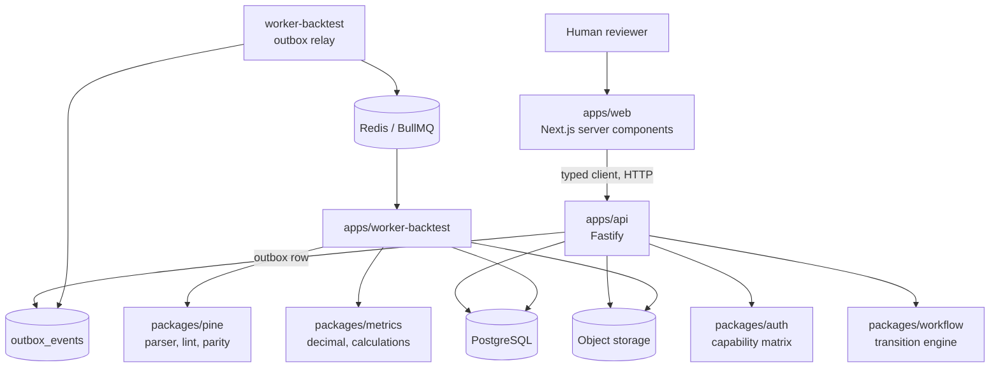
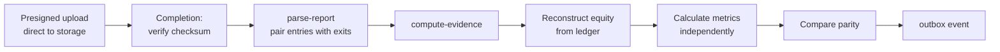

# Architecture

## Shape

Three rules explain most of the structure.

**The engine decides; the caller persists.** `packages/workflow` reads no
database and writes nothing. It receives facts, returns a typed result plus an
audit draft, and the API applies both inside one transaction. That is what
makes every transition rule testable without infrastructure, and it is why
CLAUDE.md 10 forbids scattering transition checks into route handlers.

**Workers produce evidence, never state.** Section 3.2: a worker executes a
job, stores artefacts, and emits a domain event. Whether that evidence permits
a version to move is decided by the workflow engine through the API. No worker
writes to `strategy_versions.state`.

**Reported and calculated figures never merge.** `backtest_runs.reported_metrics`
holds what the source claimed. `metric_snapshots` holds what ARF computed from
the ledger. The parity report compares them. Section 26 forbids merging them,
and keeping them in separate tables makes that structural rather than a
convention someone remembers.

## Packages

| Package | Owns | Depends on |
|---|---|---|
| `contracts` | Zod schemas, branded IDs, SDL | — |
| `auth` | Capability matrix, org boundary, verifier | contracts |
| `workflow` | Transitions, hard-fails, policy version | contracts, auth |
| `metrics` | Fixed-point decimal, metric calculation | — |
| `pine` | Hashing, lint, TradingView parser, parity | — |
| `db` | Drizzle schema, migrations, object store | contracts |
| `event-bus` | Job queue interface, BullMQ adapter | — |

`metrics` and `pine` deliberately depend on nothing. They are pure computation,
which is what lets them be tested against hand-calculated fixtures as section
14 requires.

## Applications

| App | Role |
|---|---|
| `api` | The only writer. Owns state transitions (3.2) |
| `web` | Server components; the API token never reaches the browser |
| `worker-backtest` | Ingestion pipeline and outbox relay |
| `worker-research` | Agent runs. Not yet wired |
| `worker-analytics` | Robustness testing. Not yet wired |
| `worker-forward` | Paper testing. **No order routing, ever** (3.9) |

## Ingestion pipeline

Bytes never pass through the API. It issues a signed ticket against a key
derived from the organisation and content checksum, and completion verifies the
stored object hashes to what was declared before an `artefacts` row exists.

Every step is idempotent through unique constraints rather than a "have I run
before" flag, so a retry converges on the same rows.

## What is not here

No live execution, and no code path toward it. Section 3.9 and specification
section 29 both gate it behind preconditions that are legal and operational
rather than technical. `worker-forward` exists to run paper tests and contains
no broker integration.
